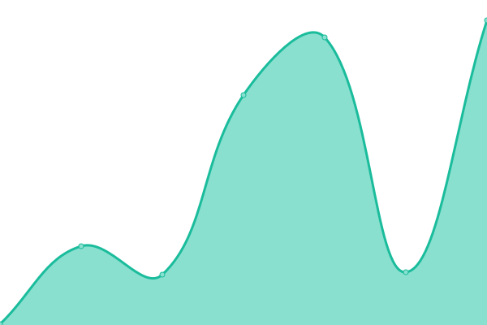

📈 Live

<!--start: status pages-->
<!-- This summary is generated by Upptime (https://github.com/upptime/upptime) -->
<!-- Do not edit this manually, your changes will be overwritten -->
<!-- prettier-ignore -->
| URL | Status | History | Response Time | Uptime |
| --- | ------ | ------- | ------------- | ------ |
|  [Catbox Litterbox](https://litterbox.catbox.moe) | 🟩 Up | [catbox-litterbox.yml](https://github.com/Howielyn/status-monitor/commits/HEAD/history/catbox-litterbox.yml) | 

 399ms
     
 | 

<a href="https://Howielyn.github.io/status-monitor/history/catbox-litterbox">100.00%</a>
    

|  [Google](https://www.google.com) | 🟩 Up | [google.yml](https://github.com/Howielyn/status-monitor/commits/HEAD/history/google.yml) | 

 81ms
     
 | 

<a href="https://Howielyn.github.io/status-monitor/history/google">100.00%</a>
    

|  [Mozilla Archive](https://archive.mozilla.org/) | 🟩 Up | [mozilla-archive.yml](https://github.com/Howielyn/status-monitor/commits/HEAD/history/mozilla-archive.yml) | 

 202ms
     
 | 

<a href="https://Howielyn.github.io/status-monitor/history/mozilla-archive">100.00%</a>
    

<!--end: status pages-->

[**Visit our status website →**](https://howielyn.github.io/status-monitor/)

## 📄 License

- Powered by: [Upptime](https://github.com/upptime/upptime)
- Code: [MIT](./LICENSE) © [Anand Chowdhary](https://anandchowdhary.com), supported by [Pabio](https://pabio.com)
- Data in the `./history` directory: [Open Database License](https://opendatacommons.org/licenses/odbl/1-0/)
